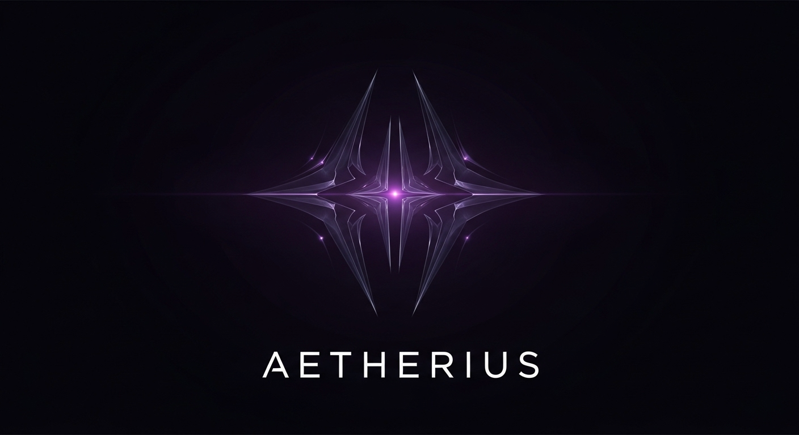

### An AI-Driven Purple Team Automation Platform

> ⚠️ **Confidential & Proprietary Project** ⚠️
>
> The source code for this project is **private**. This is due to the proprietary nature of the methodology and the novel techniques involved.
>
> This tool is the culmination of a unique approach to complex AI challenges and represents a significant strategic advantage. It is powerful, which also makes it potentially dangerous in the wrong hands. For this reason, development and operation will remain solely under my control.
>
> ---
>
> I am happy to provide a **private demonstration** to interested hiring managers. If you're looking for innovative solutions that deliver a competitive edge, please send me a message.

## Overview

**AETHERIUS** is an AI-driven framework designed to discover a system's critical vulnerability: its "ShatterPoint." 

It's an AI mentor that blends offensive strategy with automated defensive playbook generation through a conversational core.

This platform simulates, executes, and analyzes cybersecurity scenarios from both offensive (red team) and defensive (blue team) perspectives, all orchestrated by a central AI. It's not just a tool; it's a strategic system that embodies a complete security philosophy.

This single, ambitious project serves as a powerful testament to my skills and vision, proving I am not just a thinker but a builder: the true **Offensive Architect**.

## Core Philosophy: The Operator & The Architect ☯️

I did not make this project fully automated due to the incredible risks involved. An unattended offensive AI is both unintelligent and messy. Instead, AETHERIUS is built on a principle of balance.

**The AI is the architect. You are the operator.**

In this synergy, we find the yin and yang of Offensive AI. The AI provides the strategy, the attack vectors, and the defensive blueprints. The human operator provides the critical thinking, ethical oversight, and final execution.

## How It Works: The Core Loop

The project's drive is a continuous feedback loop between the AI mentor and the human operator.

1.  **Ingest**: You feed the AI target information (OSINT, network data, etc.).
2.  **Strategize**: The AI analyzes this information and provides you with a series of commands to execute.
3.  **Execute**: You run these commands in the target environment.
4.  **Analyze**: You provide the output of the commands back to the AI.
5.  **Iterate**: The AI analyzes the output to form even more sophisticated attack vectors, repeating the loop until it discovers the target's **ShatterPoint**.
6.  **Harden**: Once compromised, the AI develops defensive code, configurations, and strategic recommendations that you can implement to harden the system against the very attack it just designed.

## Showcase of My Expertise

This single project is the perfect canvas to demonstrate my entire, multifaceted skill set.

#### 🧠 Multi-Domain Intelligence: Strategic, Real-Time Analysis
The AI has the capability to query the current date and time to form a comprehensive attack based on the **politics, business, media, and psychology** of the current world by leveraging real-time search capabilities.

#### 🔴 Offensive Security & Red Teaming
The platform includes a module for **AI-generated attack plans**. The AI analyzes a target's profile (gleaned from OSINT) and devises multi-stage attack chains, demonstrating my red team and threat-hunting mindset.

#### 🤖 Offensive AI & AI Force Multiplication
The core of the platform is an **AI strategist**. This showcases my ability to not just use AI, but to architect systems where AI acts as a "force multiplier," automating complex analysis that would normally take a human team weeks.

#### 💻 OS Internals & System Hardening
The platform is designed to be distributed as a hardened, custom Linux environment (a "distro" or containerized system). This demonstrates my deep knowledge of OS internals, secure infrastructure, and system hardening. It is a custom Kali Linux version with the toolset embedded, distributed as a `.vmdk` for VMware. (This is my other private custom project known as ShadowStrikeOS)

#### 🔵 Defensive Capabilities & Blue Teaming
A key feature is the **AI-driven defensive playbook**. After an attack simulation, the AI analyzes the results and automatically generates hardening scripts, firewall rules, and detection signatures, showcasing my "purple-shaded duality."

#### 🕵️ Social Engineering & OSINT
The platform's reconnaissance module uses AI to perform **automated OSINT**, scraping public data to build a psychological and technical profile of a target organization. It can even generate convincing, context-aware phishing email templates.

#### 📈 Leadership & Strategic Vision
The project's documentation is written like an **executive summary for a CISO**, explaining how the platform turns security from a cost center into a strategic enabler. It provides a clear return on investment through automated, continuous security validation, showcasing my leadership and business acumen.

#### 👨‍💻 Development & Reverse Engineering
Building the platform required advanced **Python and C programming**, secure API integrations, and a deep understanding of how malware and exploits work (reverse engineering) to create effective and realistic simulations.

## Technical Stack

* **Core AI Model**: Utilizes the cutting-edge `[REDACTED]` model.
* **AI Framework**: A proprietary combination of `[REDACTED]` and `[REDACTED]` to create the programmer/mentor architecture.
* **Languages**: Python, C
* **Platform**: Custom Hardened Linux Distro (Kali-based)

---

### Request a Private Demonstration

**Interested in seeing AETHERIUS in action?**

Send me a message to schedule a confidential walkthrough.

WARNING: Fraudsters/Scammers Beware.
